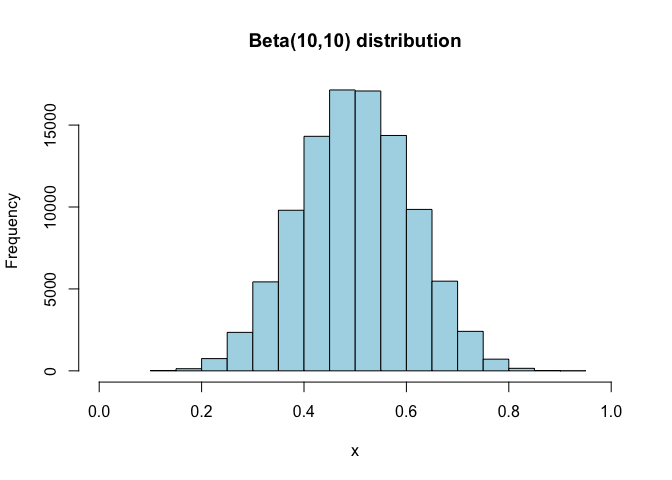
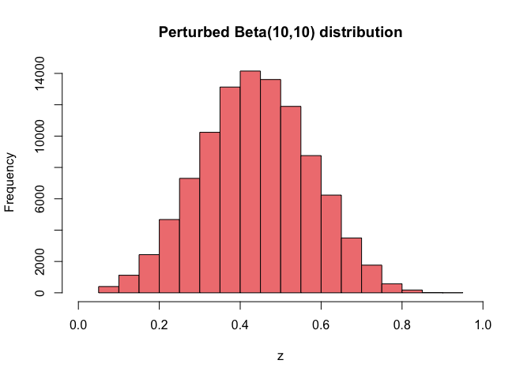

## Exercise 1: Stat4Race (2nd ed.)

## Exercise 2: Mind your own biz. . .

### Building a business is never easy

Let’s try simulating a Beta(10,10) distribution and plotting it.

``` r
set.seed(123)
M <- 10^5
m <- 20
x <- rbeta(M, 10, 10)
hist(x, breaks = m, xlim = c(0,1), col = "lightblue", main = "Beta(10,10) distribution")
```



We will apply the Perturbed Histogram (Dwork et al., 2006) to privatize
the data. The idea is to divide the data into *m* bins, and then add a
random noise to each bin. The noise is drawn from a Laplace distribution
with scale parameter $\\frac{\\epsilon}{n}$, where *ϵ* is the privacy
budget. The following code implements the Perturbed Histogram algorithm.

``` r
rlaplace <- function(n, mu = 0, b = 1) {
  r <- runif(n, 0, 1)
  r <- mu - b * sign(r - 0.5) * log(1 - 2 * abs(r - 0.5))
  return(r)
}
perturb <- function(x, epsilon, m) {
  n <- length(x)
  bin <- cut(x, m)
  bin <- as.numeric(bin)
  # count the number of elements in each bin
  count <- table(bin)
  # add noise to each bin
  count <- count + rlaplace(m, 0, 8 / epsilon^2)
  # count 0 or max
  count[count < 0] <- 0
  # return the privatized probabilities
  return(count / sum(count))
}
```

Let’s try privatizing the probabilities of our dataset with with
*ϵ* = 1, and *m* = 20.

``` r
perturb(x, 1, m)
```

    ## bin
    ##            1            2            3            4            5            6 
    ## 0.0001310661 0.0009568400 0.0033255303 0.0107249465 0.0237542812 0.0460846374 
    ##            7            8            9           10           11           12 
    ## 0.0742135171 0.1028776767 0.1312391777 0.1404651072 0.1357727195 0.1193692168 
    ##           13           14           15           16           17           18 
    ## 0.0895714901 0.0615811108 0.0342594997 0.0171688751 0.0061653054 0.0019754419 
    ##           19           20 
    ## 0.0003635604 0.0000000000

Let’s try creating a new dataset by sampling from our privatized
histogram.

``` r
# privatized histogram
q <- perturb(x, 1, m) 
# sample from the privatized histogram
z <- sample(1:m, M, replace = TRUE, prob = q) 
z <- (z - 1) / m
hist(z, breaks = m, xlim = c(0,1), col = "lightcoral", main = "Perturbed Beta(10,10) distribution")
```



### Exercise 2.1

First we need to create a function that the Mean Integrated Squared
Error (MISE) of a privatized histogram. The MISE is defined as

MISE(*p̂*,*p*) = 𝔼\[∫<sub>0</sub><sup>1</sup>(*p*(*x*)−*p̂*(*x*))<sup>2</sup> d*x*\]

where *p̂*(*i*) is the probability of the *i*th bin of the approximate
histogram, and *p*(*i*) is the probability of the *i*th bin of the
original histogram.

``` r
true_hist <- function(pdist, m) {
  pdist(1:m / m) - pdist((1:m - 1) / m)
}

mise <- function(original, approx, range, m) {
  return(range * sum((original - approx)^2) / m)
}

# Define true distribution
pdist <- function(x) pbeta(x, 10, 10)
p <- true_hist(pdist, m)
p
```

    ##  [1] 5.939339e-09 3.923943e-06 1.395775e-04 1.435613e-03 7.324159e-03
    ##  [6] 2.365008e-02 5.492024e-02 9.861842e-02 1.428721e-01 1.710359e-01
    ## [11] 1.710359e-01 1.428721e-01 9.861842e-02 5.492024e-02 2.365008e-02
    ## [16] 7.324159e-03 1.435613e-03 1.395775e-04 3.923943e-06 5.939339e-09

Let’s put the MISE function to work. We will try different values of *ϵ*
and *m*.

``` r
mise(p, q, 1, m)
```

    ## [1] 0.0002213628
